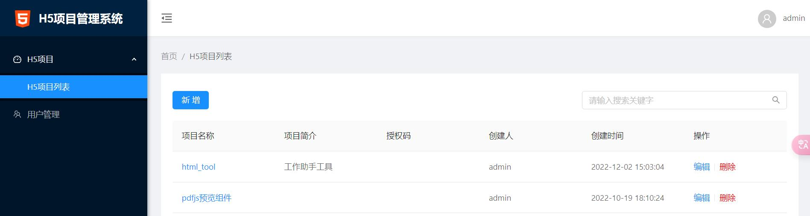

H5项目发布系统
===============

主要实现技术：

 + Thinkphp5.1
 + Ant Design Pro
 + nginx
 + mysql
 + docker
 + docker-compose

## 安装

> 安装前，机器必须安装docker、和docker-compose环境

~~~
docker-compose -d up
~~~

## 访问
然后就可以在浏览器中访问

~~~
http://localhost:1314
~~~

需要修改访问端口的，只需编辑docker-compose.yml的ports节点，初始化登录账号密码：admin/admin

# 系统截图

